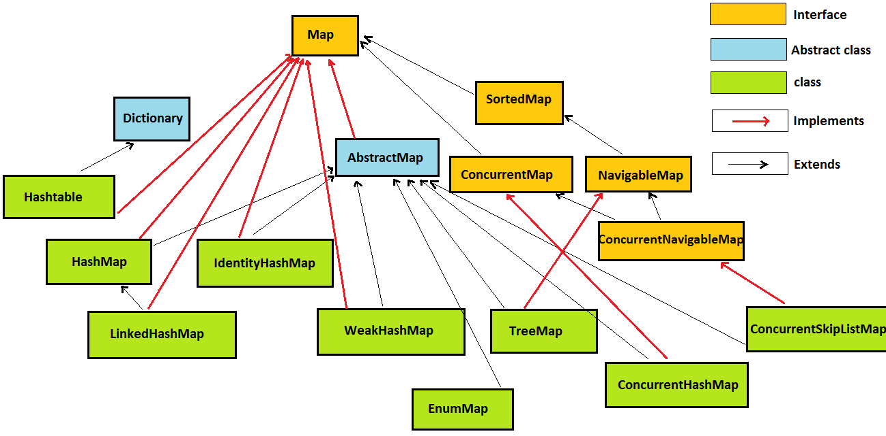

### Map interface extends which interface?
   java.util.Map interface doesn’t extends java.util.Collection interface like List and Set in java.

### Which classes implement Map interface?
   
* java.util.HashMap,
* java.util.Hashtable, 
* java.util.concurrent.ConcurrentHashMap, 
* java.util.LinkedHashMap, 
* java.util.TreeMap, 
* java.util.concurrent.ConcurrentSkipListMap, 
* java.util.IdentityHashMap, 
* java.util.WeakHashMap, 
* java.util.EnumMap classes implements java.util.Map interface.

### abstract classes like java.util.Dictionary and java.util.AbstractMap have been mentioned in hierarchy.

C:\Users\acode>javap java.util.Hashtable
Compiled from "Hashtable.java"

* public class java.util.Hashtable<K, V> extends java.util.Dictionary<K, V> implements java.util.Map<K, V>, java.lang.Cloneable, java.io.Serializable {

* public java.util.Hashtable(int, float);

* public java.util.Hashtable(int);

* public java.util.Hashtable();

* public java.util.Hashtable(java.util.Map<? extends K, ? extends V>);
  
* java.util.Hashtable(java.lang.Void);
  
* public synchronized int size();
  
* public synchronized boolean isEmpty();
  
* public synchronized java.util.Enumeration<K> keys();
  
* public synchronized java.util.Enumeration<V> elements();
  
* public synchronized boolean contains(java.lang.Object);
  
* public boolean containsValue(java.lang.Object);
  
* public synchronized boolean containsKey(java.lang.Object);
  
* public synchronized V get(java.lang.Object);
  
* protected void rehash();
  
* public synchronized V put(K, V);
  
* public synchronized V remove(java.lang.Object);
  
* public synchronized void putAll(java.util.Map<? extends K, ? extends V>);
  
* public synchronized void clear();
  
* public synchronized java.lang.Object clone();
  
* final java.util.Hashtable<?, ?> cloneHashtable();

* public synchronized java.lang.String toString();

* public java.util.Set<K> keySet();

* public java.util.Set<java.util.Map$Entry<K, V>> entrySet();

* public java.util.Collection<V> values();

* public synchronized boolean equals(java.lang.Object);

* public synchronized int hashCode();

* public synchronized V getOrDefault(java.lang.Object, V);

* public synchronized void forEach(java.util.function.BiConsumer<? super K, ? super V>);

* public synchronized void replaceAll(java.util.function.BiFunction<? super K, ? super V, ? extends V>);

* public synchronized V putIfAbsent(K, V);

* public synchronized boolean remove(java.lang.Object, java.lang.Object);

* public synchronized boolean replace(K, V, V);

* public synchronized V replace(K, V);

* public synchronized V computeIfAbsent(K, java.util.function.Function<? super K, ? extends V>);

* public synchronized V computeIfPresent(K, java.util.function.BiFunction<? super K, ? super V, ? extends V>);

* public synchronized V compute(K, java.util.function.BiFunction<? super K, ? super V, ? extends V>);

* public synchronized V merge(K, V, java.util.function.BiFunction<? super V, ? super V, ? extends V>);

* void writeHashtable(java.io.ObjectOutputStream) throws java.io.IOException;

* final void defaultWriteHashtable(java.io.ObjectOutputStream, int, float) throws java.io.IOException;

* void readHashtable(java.io.ObjectInputStream) throws java.io.IOException, java.lang.ClassNotFoundException;
}

